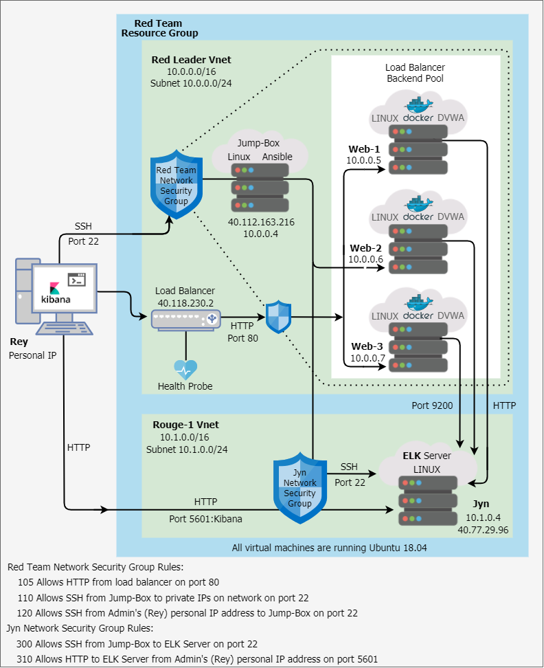
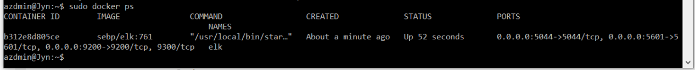

## Automated ELK Stack Deployment

The files in this repository were used to configure the network depicted below.

These files have been tested and used to generate a live ELK deployment on Azure. They can be used to either recreate the entire deployment pictured above. Alternatively, select portions of the .yml file may be used to install only certain pieces of it, such as Filebeat.

  - [.yml_Playbooks](/Ansible)

This document contains the following details:
- Description of the Topology
- Access Policies
- ELK Configuration
  - Beats in Use
  - Machines Being Monitored
- How to Use the Ansible Build

### Description of the Topology

The main purpose of this network is to expose a load-balanced and monitored instance of DVWA, the D*mn Vulnerable Web Application.

Load balancing ensures that the application will be highly available, in addition to restricting incoming traffic to the network. 
- Load Balancers can prevent DDoS attacks by managing the flow of traffic ensuring that servers don’t get overwhelmed. 

- The Jump-box is used to create a controlled access point that is only avaiable to system administrators which allows them to access the network while keeping it hidden from the public.

Integrating an ELK server allows users to easily monitor the vulnerable VMs for changes to systems logs and metrics.
- Filebeat is utilized to monitor log files and log events. 
- Metricbeat collects metrics from the OS and active services running on the server.  

The configuration details of each machine may be found below:

|   Name   |     Function     | IP Address |   Operating System   |
|:--------:|:----------------:|:----------:|:--------------------:|
| Jump-Box |      Gateway     |  10.0.0.4  | Linux - Ubuntu 18.04 |
|   Web-1  |    Web Server    |  10.0.0.5  | Linux - Ubuntu 18.04 |
|   Web-2  |    Web Server    |  10.0.0.6  | Linux - Ubuntu 18.04 |
|   Web-3  |    Web Server    |  10.0.0.7  | Linux - Ubuntu 18.04 |
|    Jyn   | Monitoring (ELK) |  10.1.0.4  | Linux - Ubuntu 18.04 |

### Access Policies

The machines on the internal network are not exposed to the public Internet. 

Only the Jump-Box machine can accept connections from the Internet. Access to this machine is only allowed from the following IP address:
- Administrator’s IP address

- The only way machines on the network can be accessed is through the Jump-Box which connects to the servers, including the ELK server, via its interanl IP address of 10.0.0.4. 

A summary of the access policies in place can be found in the table below.

|   Name   | Publicly Accessible |  Allowed IP Addresses |
|:--------:|:-------------------:|:---------------------:|
| Jump-Box |          No         |       Admin's IP      |
|   Web-1  |          No         |        10.0.0.4       |
|   Web-2  |          No         |        10.0.0.4       |
|   Web-3  |          No         |        10.0.0.4       |
|    Jyn   |          No         | 10.0.0.4 & Admin's IP |

### Elk Configuration

Ansible was used to automate the configuration of the ELK machine. No configuration was performed manually, which is advantageous because automation not only reduces the chance of errors but also allows multiple machines to be configured at once which is vastly more efficient than manually configuring each machine individually. In addition, the existing files are easy to edit should changes or updates need to be made in the future. 

The playbook implements the following tasks:

- Install docker.io
- Install python-3-pip
- Install Docker module
- Increase virtual memory 
- Download and launch a docker elk container
- Enable service docker on boot so that docker starts everytime the system is started

The following screenshot displays the result of running `docker ps` after successfully configuring the ELK instance.

### Target Machines & Beats
This ELK server is configured to monitor the following machines:
- Web-1 10.0.0.5
- Web-2 10.0.0.6
- Web-3 10.0.0.7

We have installed the following Beats on these machines:
- Filebeat
- Metricbeat

These Beats allow us to collect the following information from each machine:
- Filebeat is a log shipper used to tail log files such as, audit logs, server logs, slow logs and deprecation logs. The log data can then either be forwarded to Logstash for more advanced processing or sent directly to Elasticsearch for indexing.
- Metricbeat functions much like Filebeat but instead of log files, Metricbeat ships host metrics such as CPU usage and memory statistics. In environemtns using containers Metricbeat can also be used to measure container performance metrics. 

### Using the Playbook
In order to use the playbook, you will need to have an Ansible control node already configured. Assuming you have such a control node provisioned: 

SSH into the control node and follow the steps below:
- Copy the [.yml](/Ansible) file to /etc/ansible
- Update /etc/hosts to enable the playbook to run on the correct machines run the following commands:
  - sudo /etc/hosts
  - sudo nano hosts
- Make the following changes to the hosts file
  - [webservers]
  - 10.0.0.5 ansible_python_interpreter=/usr/bin/python3
  - 10.0.0.6 ansible_python_interpreter=/usr/bin/python3 
  - 10.0.0.7 ansible_python_interpreter=/usr/bin/python3 
  - [elk]
  - 10.1.0.4 ansible_python_interpreter=/usr/bin/python3
-  
- Run the playbook, and navigate to ____ to check that the installation worked as expected.

_TODO: Answer the following questions to fill in the blanks:_
- _Which file is the playbook? Where do you copy it?_
- _Which file do you update to make Ansible run the playbook on a specific machine? How do I specify which machine to install the ELK server on versus which to install Filebeat on?_
- _Which URL do you navigate to in order to check that the ELK server is running?

_As a **Bonus**, provide the specific commands the user will need to run to download the playbook, update the files, etc._
